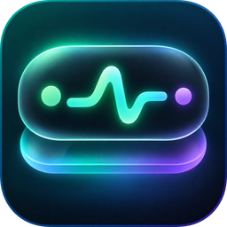
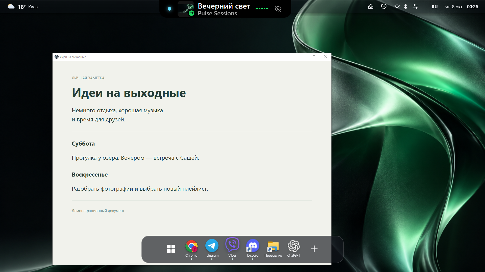
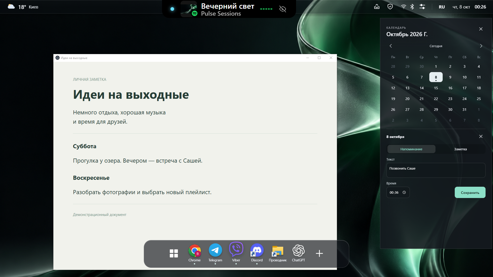
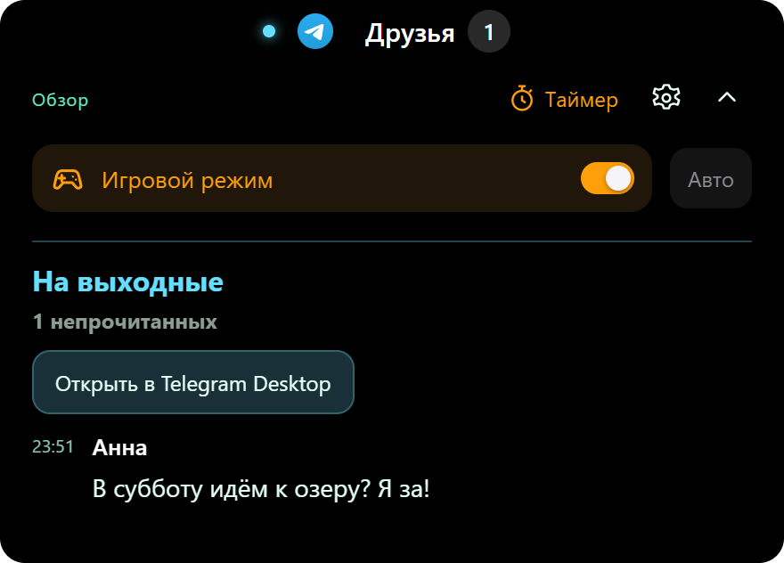

<h1 align="center">Pulse for Windows</h1>

<strong>Keep what matters close.</strong> 
Music, messages and plans in a compact desktop island. 
Your favourite apps in a floating dock.

<strong><a href="https://github.com/VP-code98/pulse-downloads/releases/latest/download/Pulse-Setup-0.13.5.exe">Download Pulse for Windows ↓</a></strong> 
Free beta · Windows 10 / 11 · x64 · version 0.13.5

<a href="https://pulse-desktop.pp.ua/">Website</a> · <a href="https://github.com/VP-code98/pulse-downloads/releases/latest">Release details</a> · <a href="README.md">Русский</a>

Pulse adds a notification island, a translucent top bar and a floating application dock to Windows. Hover over the island to see more, or move your pointer to the bottom edge to reach your apps. Screenshots use demonstration data; the current app interface is in Russian.

> **Gmail verification is in progress.** Google has verified the Pulse branding; review of Gmail data access is pending. Gmail is not yet offered for unrestricted public onboarding, and Google may display an unverified-app warning. Other features do not require a Google connection.

## What you can do

| Feature | How it helps |
| --- | --- |
| Music controls | View artwork and switch tracks from apps that expose a Windows media session. |
| Telegram and Viber | See unread messages from the chats you select and jump back to the conversation. |
| Timer | Start a countdown from the island and get an alert when it finishes. |
| Calendar and reminders | Create local dated notes and timed reminders directly in the calendar. |
| Floating dock | Reach Start, pinned apps and open windows from the bottom edge. |
| Top bar | Check weather, time and keyboard layout, or open the calendar and quick settings. |
| Quick settings | Reach Wi-Fi, Bluetooth, volume and saved Windows VPN connections. |
| Mail and websites | Connect iCloud Mail and collect new Windows browser notifications from websites you add. Gmail remains under review. |

## Plan something, then get on with your day

Click the top-bar date or time, select a day, choose **«+ Напоминание или заметка»**, enter your text and reminder time, then save. Reminders appear in the island; notes stay attached to the selected date.

## Game mode

Hover over the island and switch **«Игровой режим»** on. Settings let you pause the player display and mail polling while Telegram, Viber, timers and reminders keep working. Top-bar blur is disabled. Automatic activation currently follows the active CS2 process; use manual activation for other games. No FPS improvement is claimed.

## Install and set up

1. [Download the installer](https://github.com/VP-code98/pulse-downloads/releases/latest/download/Pulse-Setup-0.13.5.exe) and run it. No Node.js or source checkout is needed.
2. New installations default to **Program Files** and request administrator approval.
3. Open **«Настройки и напоминания»** from the Pulse tray icon. Enable **«Верхняя панель из матового стекла»** and **«Плавающий док»**, then click **«Сохранить настройки»**. Both features are off after a fresh installation.
4. Under **«Подключения»**, connect your services and choose your chats. Telegram uses its own session; Viber Desktop must stay running, and its window may be minimized.

The installer is currently **unsigned**, so Windows may show an unknown-publisher or SmartScreen warning. This release targets Windows x64; Windows ARM support is not claimed. Verify the release using [SHA256SUMS.txt](SHA256SUMS.txt).

For an update, exit Pulse from its tray icon and run the new installer. Settings and connections are stored in your Windows user profile, separately from the application folder.

[Setup guide with screenshots, in Russian](docs/QUICKSTART.md) · [FAQ, in Russian](docs/FAQ.md)

## Feedback and privacy

- [Report a bug](https://github.com/VP-code98/pulse-downloads/issues/new?template=bug_report.yml)
- [Suggest a feature](https://github.com/VP-code98/pulse-downloads/issues/new?template=feature_request.yml)
- [Contact the author privately](mailto:poljukhvlad@icloud.com)
- [Privacy policy](https://pulse-desktop.pp.ua/privacy) · [Terms](https://pulse-desktop.pp.ua/terms)

GitHub issues are public. Send questions involving private information by email. If Pulse is useful to you, a ⭐ helps you keep track of the project and supports its development.
