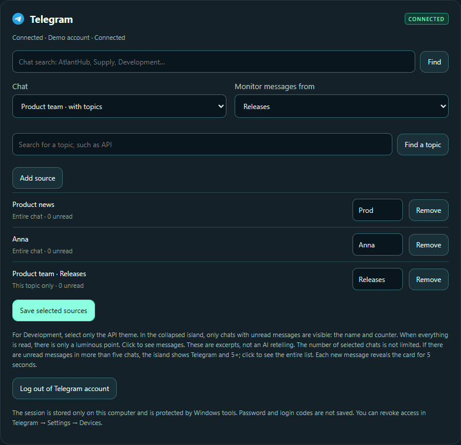
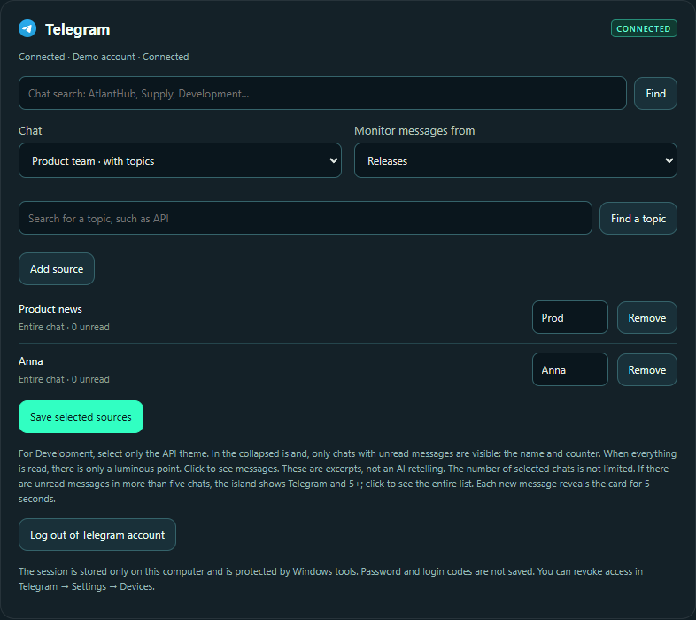

<p align="center"></p>

<h1 align="center">Pulse for Windows</h1>

<p align="center"><strong>Keep what matters close.</strong><br>
Notifications from the Telegram chats, groups and channels you choose.<br>Follow a single topic within a forum group.<br>
Your favourite apps in a floating dock.</p>

<p align="center"><strong><a href="https://github.com/VP-code98/pulse-downloads/releases/latest/download/Pulse-Setup-0.13.8.exe">Download Pulse for Windows ↓</a></strong><br>
Free beta · Windows 10 / 11 · x64 · version 0.13.8</p>

<p align="center"><a href="https://pulse-desktop.pp.ua/">Website</a> · <a href="https://github.com/VP-code98/pulse-downloads/releases/latest">Release details</a> · <a href="README.md">Русский</a></p>

<p align="center"><a href="#support-pulse">Support Pulse ↓</a></p>


Pulse adds a notification island, a translucent top bar and a floating application dock to Windows. Hover over the island to see more, or move your pointer to the bottom edge to reach your apps. The complete app interface is available in English, Ukrainian and Russian. Select **English** in **Interface language** at the top of settings; changes apply immediately and persist after restart. Connections and selected chats are preserved. Screenshots use demonstration data. The website offers Russian and Ukrainian with a RU/UA switcher.

> **Gmail verification is in progress.** Google has verified the Pulse branding; review of Gmail data access is pending. Gmail is not yet offered for unrestricted public onboarding, and Google may display an unverified-app warning. Other features do not require a Google connection.

## Choose conversations, down to a single topic

Pulse’s main advantage is **notifications from specific sources you choose**. Select a Telegram direct chat, group or subscribed channel. In a forum group, follow a single topic: messages from other topics in that group stay out of Pulse.

For example: **Anna** + **Product team → Releases** + **Product news**. You can also select individual Viber chats.



1. Open **Connections → Telegram** in settings and sign in.
2. Search the chat, group or channel name, click **Find**, then choose the result under **Chat**. Channels use the same field; subscribe to the channel in Telegram first.
3. For a forum group, choose the topic under **Monitor messages from** instead of **Entire chat**. To follow just one topic, do not also add the entire same group.
4. Click **Add source**, then **Save selected sources**. Repeat for other conversations you want to follow.



Under Viber, connect Viber Desktop, search the list and check the chats you want. Choices save immediately.

These choices control Pulse notifications. Telegram and Viber’s own notification settings remain separate. Telegram sources must be accessible to your account. Telegram Desktop can be closed; Viber Desktop must remain running, and may be minimized.

## What you can do

| Feature | How it helps |
| --- | --- |
| Music controls | View artwork and switch tracks from apps that expose a Windows media session. |
| Telegram and Viber | See unread messages from chosen Telegram chats, groups, channels and individual forum topics, plus selected Viber chats and jump back to the conversation. |
| Timer | Start a countdown from the island and get an alert when it finishes. |
| Calendar and reminders | Create local dated notes and timed reminders directly in the calendar. |
| Floating dock | Reach Start, pinned apps and open windows from the bottom edge. |
| Top bar | Check weather, time and keyboard layout, or open the calendar and quick settings. |
| Quick settings | Reach Wi-Fi, Bluetooth, volume and saved Windows VPN connections. |
| Mail and websites | Connect iCloud Mail and collect new Windows browser notifications from websites you add. Gmail remains under review. |

## Plan something, then get on with your day

Click the top-bar date or time, select a day, choose **Add reminder or note**, enter your text and reminder time, then save. Reminders appear in the island; notes stay attached to the selected date.


## Game mode

Hover over the island and switch **Game mode** on. Settings let you pause the player display and mail polling while Telegram, Viber, timers and reminders keep working. Top-bar blur is disabled. Automatic activation currently follows the active CS2 process; use manual activation for other games. No FPS improvement is claimed.


## Install and set up

1. [Download the installer](https://github.com/VP-code98/pulse-downloads/releases/latest/download/Pulse-Setup-0.13.8.exe) and run it. No Node.js or source checkout is needed.
2. New installations default to **Program Files** and request administrator approval.
3. Open **Settings and reminders** from the Pulse tray icon. Enable **Frosted-glass top bar** and **Floating dock**, then click **Save settings**. Both features are off after a fresh installation.
4. Under **Connections**, connect your services and choose your chats. Telegram uses its own session; Viber Desktop must stay running, and its window may be minimized.

The installer is currently **unsigned**, so Windows may show an unknown-publisher or SmartScreen warning. This release targets Windows x64; Windows ARM support is not claimed. Verify the release using [SHA256SUMS.txt](SHA256SUMS.txt).

For an update, exit Pulse from its tray icon and run the new installer. Settings and connections are stored in your Windows user profile, separately from the application folder.

[Setup guide with screenshots, in Russian](docs/QUICKSTART.md) · [FAQ, in Russian](docs/FAQ.md)

### Downloads

[](https://github.com/VP-code98/pulse-downloads/releases/tag/v0.13.8)

This counter tracks GitHub downloads of this version's installer and refreshes automatically with a short delay. Repeat downloads count too; it does not measure unique users or installations.

## Support Pulse

If Pulse makes your day easier, you can support its development with a voluntary donation. Any amount is welcome. The app is free to use; a donation is not required to access its features.

**[Donate by card via PrivatBank ↗](https://www.privat24.ua/send/ki5x3)**

**USDT · Tron (TRC20)**

```text
TR6iMMXPhUjoFsaXdZUrpA3uv1aei4ueKb
```


Send only **USDT on the Tron (TRC20) network**. The QR code contains the recipient address; choose the network in your wallet. Check the network fee and minimum deposit amount before sending.

[Open the support section and copy the address →](https://pulse-desktop.pp.ua/#support)

## Feedback and privacy

- [Report a bug](https://github.com/VP-code98/pulse-downloads/issues/new?template=bug_report.yml)
- [Suggest a feature](https://github.com/VP-code98/pulse-downloads/issues/new?template=feature_request.yml)
- [Contact the author privately](mailto:poljukhvlad@icloud.com)
- [Privacy policy](https://pulse-desktop.pp.ua/privacy) · [Terms](https://pulse-desktop.pp.ua/terms)

GitHub issues are public. Send questions involving private information by email. If Pulse is useful to you, a ⭐ helps you keep track of the project and supports its development.

[Текст для обзора / Overview copy / Текст для огляду →](docs/OVERVIEW.md)
