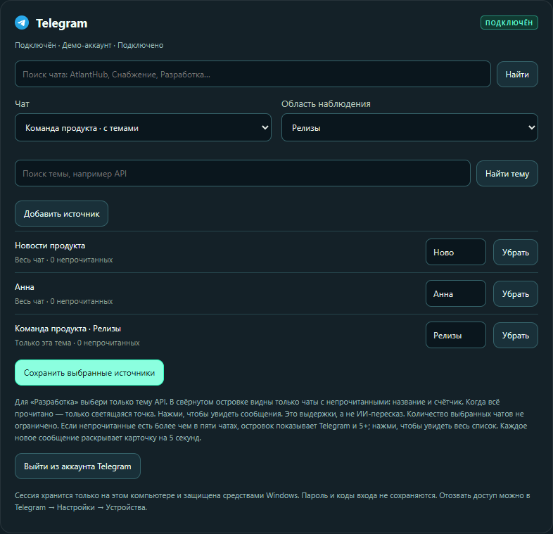
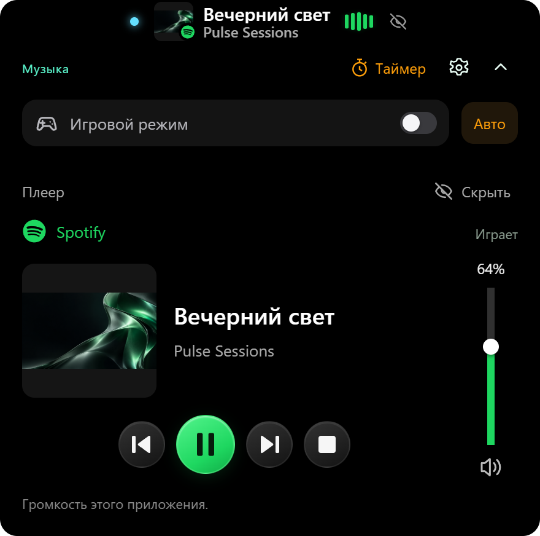
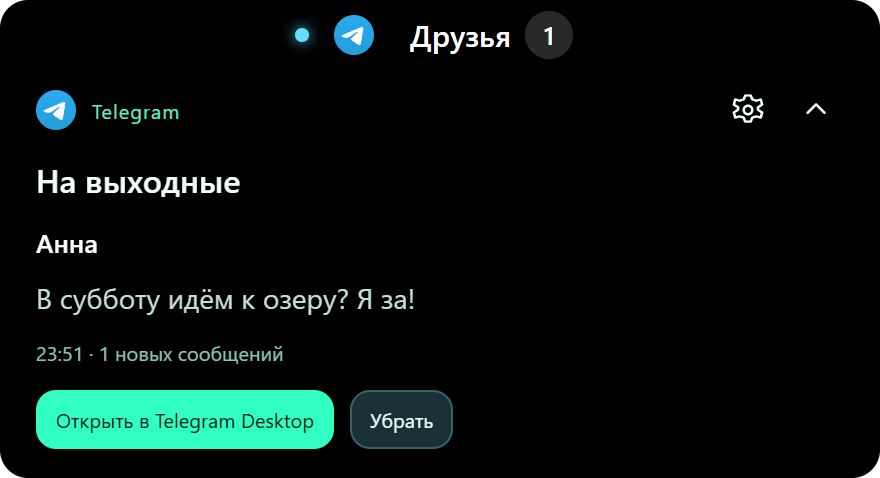
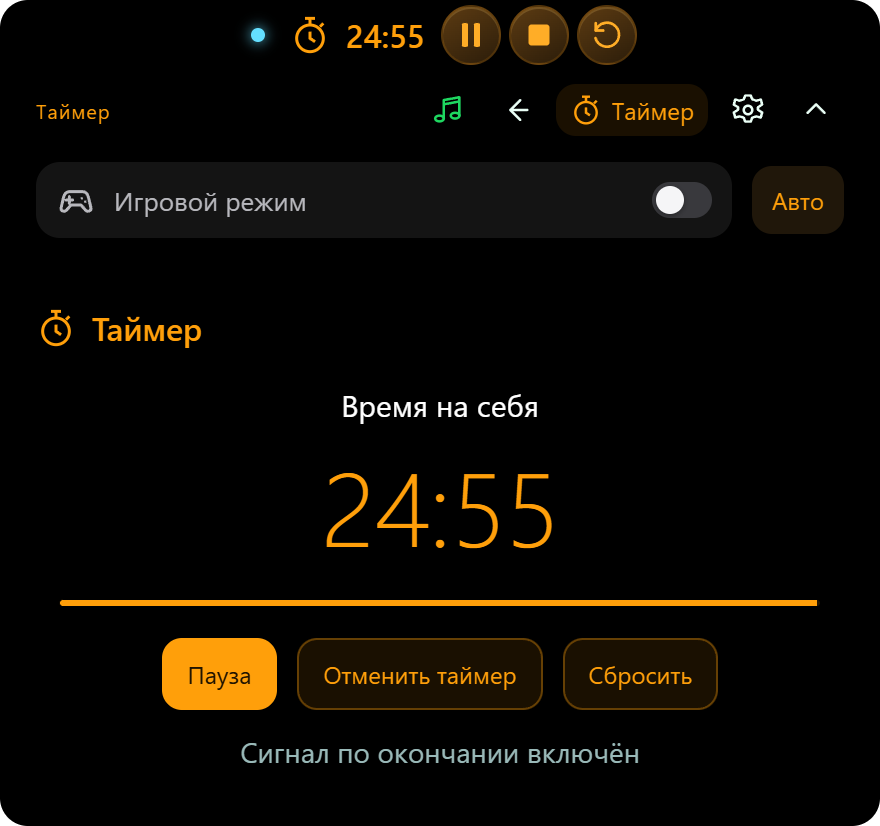
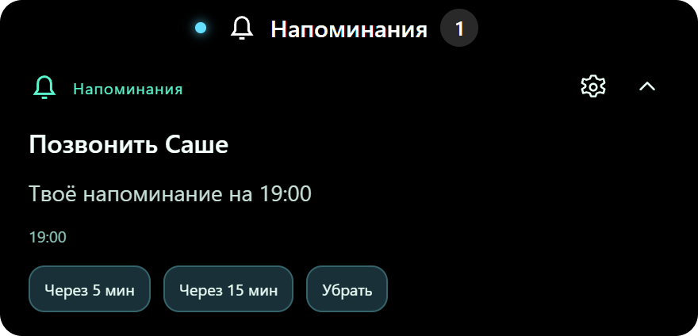
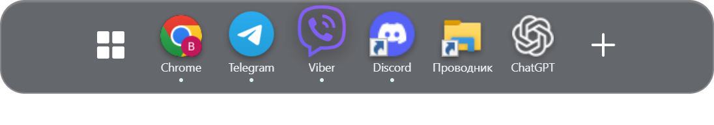
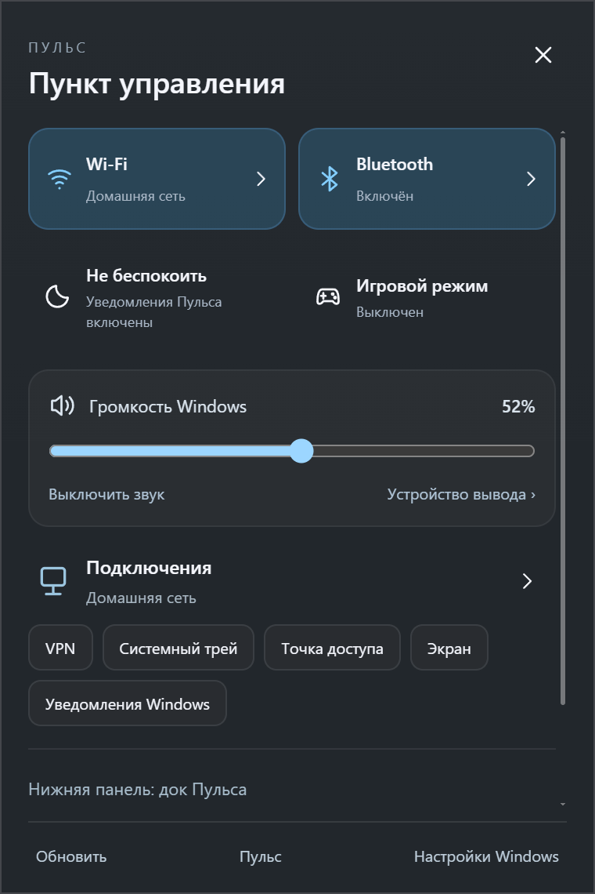

<p align="center">
  
</p>

<h1 align="center">Пульс · Pulse для Windows</h1>

<p align="center"><strong>Ближе к важному. Легче с Пульсом.</strong><br>
Уведомления от выбранных чатов, групп и каналов Telegram.<br>В группе с темами — вплоть до одной нужной темы.<br>
Любимые приложения — в лёгком плавающем доке.</p>

<p align="center">
  <a href="https://github.com/VP-code98/pulse-downloads/releases/latest/download/Pulse-Setup-0.13.8.exe"></a>
</p>

<p align="center">
  <strong>Бесплатная бета · Windows 10 / 11 · x64 · версия 0.13.8</strong><br>
  <a href="https://pulse-desktop.pp.ua/">Сайт</a> ·
  <a href="docs/QUICKSTART.md">Первый запуск</a> ·
  <a href="https://github.com/VP-code98/pulse-downloads/releases/latest">Все файлы выпуска</a> ·
  <a href="README.en.md">English</a>
</p>

<p align="center"><a href="#поддержать-пульс">Поддержать Пульс ↓</a></p>

<p align="center"></p>

Пульс — приложение для Windows с компактным островком уведомлений, верхней панелью и плавающим доком. Посмотри сообщение, переключи трек или запиши напоминание, продолжая заниматься своим делом. Наведи курсор на островок, чтобы раскрыть подробности; подведи курсор к нижнему краю, чтобы открыть приложения в доке.

Интерфейс доступен на русском, украинском и английском. Выбери **«Язык интерфейса»** в начале настроек — язык применяется сразу и сохраняется после перезапуска. Подключения и выбранные чаты сохраняются. Сайт доступен на русском и украинском с переключателем RU/UA.

Скриншоты показывают интерфейс с демонстрационными данными.

> **Gmail проходит проверку Google.** Бренд Пульса уже подтверждён, заявка на доступ к Gmail рассматривается. Массовое подключение Gmail пока не объявлено доступным; Google может показывать предупреждение о непроверенном приложении. Для остальных функций подключение Google не требуется.

## Выбирай разговоры — вплоть до одной темы

Главное преимущество Пульса — **уведомления от конкретных источников, которые выбираешь ты**. Добавь личный чат, нужную группу или канал Telegram. В группе с темами можно выбрать одну тему: остальные темы этой группы не будут появляться в Пульсе.

Например: **Анна** + **Команда продукта → Релизы** + **Новости продукта**. В Viber тоже отмечаются только нужные чаты.



1. Открой **Подключения → Telegram** в настройках и войди в свой аккаунт.
2. Введи название чата, группы или канала → **«Найти»** → выбери результат в поле **«Чат»**. Канал выбирается здесь же; сначала подпишись на него в Telegram.
3. В группе с темами выбери нужную в **«Область наблюдения»** вместо **«Весь чат»**. Для фильтра одной темы не добавляй одновременно всю ту же группу.
4. Нажми **«Добавить источник»**, затем **«Сохранить выбранные источники»**. Повтори для остальных нужных разговоров.

[Пошаговый выбор с крупными скриншотами →](docs/QUICKSTART.md#telegram-чаты-группы-каналы-и-темы)

Выбор управляет уведомлениями Пульса; настройки уведомлений самого Telegram и Viber ты меняешь отдельно. В Telegram доступны источники твоего аккаунта. Telegram Desktop можно закрыть; Viber Desktop должен оставаться запущенным, хотя бы свёрнутым.

## Маленький островок. Много полезного.

| Возможность | Что рядом с тобой |
| --- | --- |
| **Музыка** | Обложка, трек и управление воспроизведением из приложений, поддерживающих медиасессии Windows. |
| **Сообщения** | Непрочитанные из выбранных чатов, групп, каналов и отдельных тем Telegram, а также выбранных чатов Viber. Открой нужный чат из уведомления. |
| **Таймер** | Запусти отсчёт в раскрытом островке и получи сигнал, когда время закончится. |
| **Напоминания и заметки** | Выбери дату в календаре и сохрани план. Напоминание появится в островке в назначенное время. |
| **Плавающий док** | Пуск, открытые окна и закреплённые приложения у нижнего края экрана. |
| **Верхняя панель** | Погода, дата, время, раскладка клавиатуры и быстрый доступ к настройкам. |
| **Пункт управления** | Wi-Fi, Bluetooth, громкость, сохранённые VPN Windows и переходы к системным настройкам. |
| **Почта и сайты** | iCloud Mail и новые браузерные уведомления добавленных сайтов. Gmail — после завершения проверки Google. |

<table>
  <tr>
    <td width="50%"><strong>Музыка под рукой</strong><br></td>
    <td width="50%"><strong>Нужные сообщения</strong><br></td>
  </tr>
  <tr>
    <td><strong>Время на твоей стороне</strong><br></td>
    <td><strong>Планы не потеряются</strong><br></td>
  </tr>
</table>

## Док появляется, когда зовёшь

Подведи курсор к нижнему краю — появятся Пуск и приложения. Убери курсор — док спрячется. Закрепляй любимые программы и переключайся между открытыми окнами. Док включается в настройках; при его выключении возвращается панель задач Windows.

<p align="center"></p>

## Напоминание — прямо из календаря

Нажми **дату или время в верхней панели → выбери день → «+ Напоминание или заметка»**. Напиши текст, укажи время и нажми **«Сохранить»**. Для заметки сигнал не нужен — она останется у выбранной даты.

<p align="center"></p>

## Привычные действия немного ближе

Открой пункт управления кнопкой с ползунками справа в верхней панели. Подключай сохранённые сети Wi-Fi, управляй Bluetooth и громкостью. Кнопка со щитом открывает сохранённые VPN Windows. Пароли сетей и VPN остаются под управлением Windows.

<p align="center"></p>

## Игровой режим — ты выбираешь, что оставить

Наведи курсор на островок и включи **«Игровой режим»**. В настройках можно приостановить отображение плеера и проверку почты; сообщения Telegram и Viber, таймер и напоминания продолжают работать. Размытие верхней панели отключается. Режим **«Авто»** включается, когда активна CS2; для других игр используй ручное включение.

<p align="center"></p>

## Скачать и начать

1. [Скачай установщик Пульса 0.13.8](https://github.com/VP-code98/pulse-downloads/releases/latest/download/Pulse-Setup-0.13.8.exe) и запусти его. Node.js и исходники не нужны.
2. Установи приложение. По умолчанию новая установка использует **Program Files**; Windows запросит права администратора.
3. Через значок Пульса в системном трее открой **«Настройки и напоминания»**. Включи верхнюю панель и плавающий док, затем нажми **«Сохранить настройки»**. После новой установки панель и док выключены.
4. В блоке **«Подключения»** подключи нужные сервисы и выбери чаты.

**Установщик пока не подписан доверенным сертификатом:** Windows может показать «Неизвестный издатель» или предупреждение SmartScreen. Информация о выпуске и контрольная сумма доступны в [Releases](https://github.com/VP-code98/pulse-downloads/releases/latest). Сборка предназначена для Windows x64; Windows ARM не заявлена поддерживаемой.

[Пошаговая инструкция со скриншотами →](docs/QUICKSTART.md) · [Вопросы и решения →](docs/FAQ.md)

### Скачивания

[](https://github.com/VP-code98/pulse-downloads/releases/tag/v0.13.8)

Счётчик показывает загрузки установщика этой версии с GitHub и обновляется автоматически с небольшой задержкой. Повторные загрузки тоже учитываются; это не число пользователей или установок.

## Поддержать Пульс

Если Пульс делает твой день удобнее, можешь поддержать его развитие. Любая сумма — по желанию. Приложением можно пользоваться бесплатно; донат не нужен для доступа к функциям.

**[Поддержать картой через конверт ПриватБанка ↗](https://www.privat24.ua/send/ki5x3)**

**USDT · Tron (TRC20)**

```text
TR6iMMXPhUjoFsaXdZUrpA3uv1aei4ueKb
```


Отправляй только **USDT в сети Tron (TRC20)**. QR-код содержит адрес получателя; сеть нужно выбрать в кошельке. Комиссию сети и минимальную сумму пополнения проверь перед переводом.

[Открыть блок поддержки на сайте и скопировать адрес →](https://pulse-desktop.pp.ua/#support)

## Обновления и обратная связь

Для обновления заверши Пульс через его значок в трее и запусти новый официальный установщик. Настройки и подключения хранятся в твоём пользовательском профиле отдельно от папки программы.

- [Сообщить об ошибке](https://github.com/VP-code98/pulse-downloads/issues/new?template=bug_report.yml)
- [Предложить улучшение](https://github.com/VP-code98/pulse-downloads/issues/new?template=feature_request.yml)
- [Связаться с автором](mailto:poljukhvlad@icloud.com)
- [Политика конфиденциальности](https://pulse-desktop.pp.ua/privacy) · [Условия использования](https://pulse-desktop.pp.ua/terms)

Issues на GitHub публичны. Вопросы с личными данными отправляй автору по почте. Если Пульс оказался полезен, можно поставить ⭐ репозиторию, чтобы сохранить его и поддержать проект.

---

**Pulse for Windows** — a free desktop notification island, floating app dock, music controls, timer, local reminders and quick settings for Windows 10/11 x64. [Read in English →](README.en.md)

[Текст для обзора / Overview copy / Текст для огляду →](docs/OVERVIEW.md)
