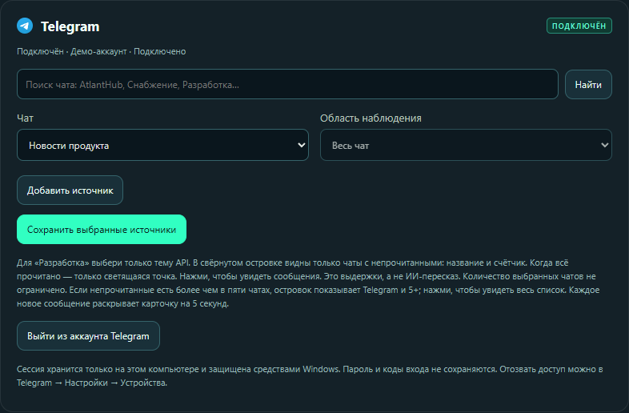
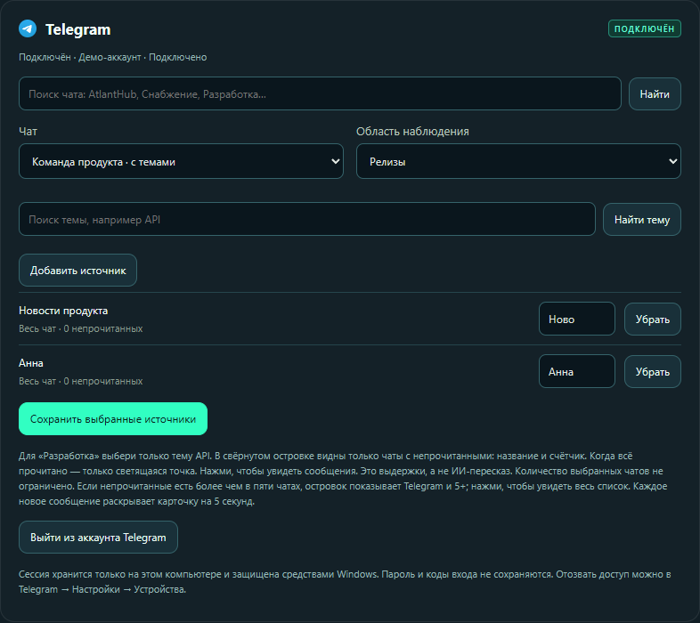
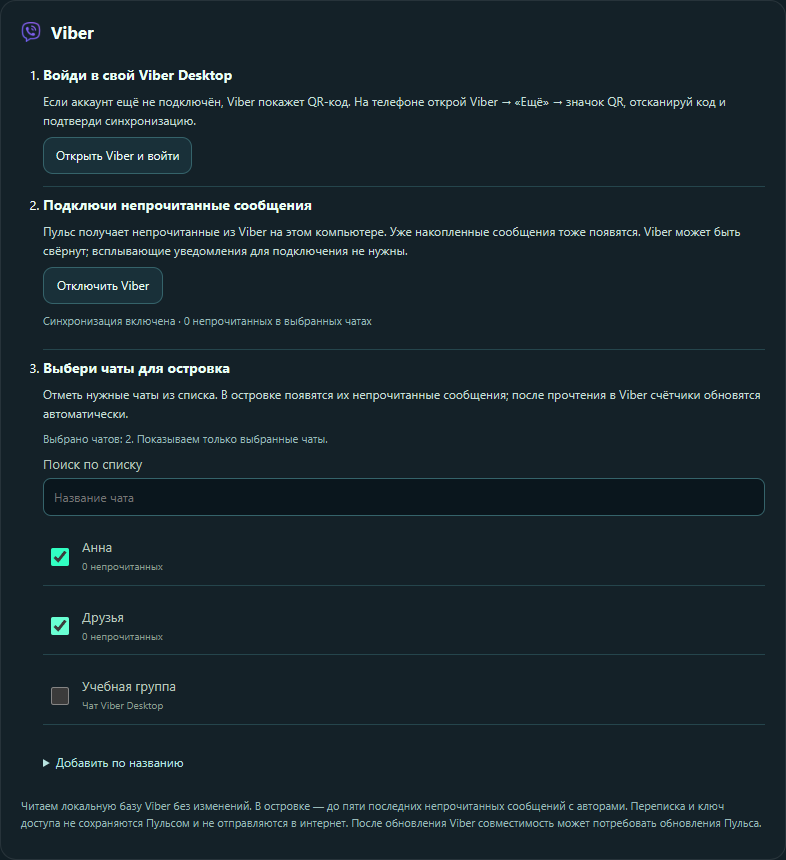

# Первый запуск Пульса

[← Страница Пульса](../README.md) · [Скачать установщик](https://github.com/VP-code98/pulse-downloads/releases/latest/download/Pulse-Setup-0.13.7.exe)

## 1. Установи и открой

Скачай `Pulse-Setup-0.13.7.exe`, запусти мастер и выбери папку. Новая установка по умолчанию использует Program Files и запрашивает права администратора. Node.js не нужен. Установщик пока не подписан доверенным сертификатом; Windows может показать предупреждение об издателе.

После запуска найди значок Пульса в системном трее, при необходимости раскрыв скрытые значки. Открой **«Настройки и напоминания»**.

## 2. Настрой рабочий стол

Первый блок — **«Настройки Пульса»**. В поле **«Язык интерфейса»** выбери **Русский**, **Українська** или **English**. Язык применяется сразу; сохранять и заново подключать сервисы не нужно.

Затем настрой поведение:

- Включи **«Верхняя панель из матового стекла»**, чтобы рядом с островком появились погода, часы, календарь и пункт управления.
- Включи **«Плавающий док»**, если хочешь использовать его у нижнего края. При выключении дока возвращается панель задач Windows.
- При включённой верхней панели место под островок выделяется автоматически. Для отдельного островка можно включить **«Выделить место под островок»**.
- Выбери нужный экран в поле **«Монитор»** или оставь автоматический выбор.
- В разделе **«Ритм и внимание»** настрой игровой режим, паузу почты и плеера, звук уведомлений и «Не беспокоить». Автоматический игровой режим сейчас относится к активной CS2.
- Если нужно, включи запуск вместе с Windows.

Нажми **«Сохранить настройки»** в конце первого блока. После новой установки верхняя панель и док выключены — это не ошибка.

## 3. Подключи нужное

Второй блок — **«Подключения»**. У сервисов собственные кнопки подключения и сохранения.

### Telegram: чаты, группы, каналы и темы

Главная возможность Пульса — выбирать **конкретные источники сообщений**, включая одну тему в группе Telegram. Подключи аккаунт в карточке Telegram, затем:

1. **Найди источник.** Введи название личного чата, группы или канала и нажми **«Найти»**. Выбери результат в поле **«Чат»**. Каналы находятся в том же списке; для получения сообщений сначала подпишись на канал в Telegram.

2. **Выбери тему группы.** Если у группы есть темы, выбери нужную в **«Область наблюдения»**. Кнопка **«Найти тему»** помогает отыскать её. **«Весь чат»** означает всю группу; для выбора одной темы не добавляй одновременно всю ту же группу.

3. **Добавь и сохрани.** Нажми **«Добавить источник»**. При желании поменяй короткую подпись для островка. Повтори шаги для других нужных источников и нажми **«Сохранить выбранные источники»**.

На примере выбраны **Анна**, **Команда продукта → Релизы** и **Новости продукта**. Скриншоты используют демонстрационные данные. Выбор управляет сообщениями в Пульсе, а не настройками уведомлений самого Telegram.

Telegram Desktop можно закрыть: у Пульса собственная сессия. Чтобы убрать источник, нажми **«Убрать»**, затем сохрани список. Выход из аккаунта выполняется отдельной кнопкой.

### Viber: только выбранные чаты

1. Войди в Viber Desktop и нажми **«Подключить Viber»** в Пульсе.
2. Найди разговор в **«Поиск по списку»**.
3. Отметь галочками нужные чаты. Выбор сохраняется сразу, общей кнопки сохранения не нужно. Сними галочку, чтобы убрать источник.

Viber Desktop должен оставаться запущенным; окно можно свернуть. Пульс также покажет уже накопленные непрочитанные сообщения выбранных чатов.

### Gmail

Публичная проверка доступа Google ещё идёт. Пока она не завершена, Gmail не заявлен готовым для массового подключения. Участники проверки входят кнопкой **«Войти через Google»** через системный браузер. Пароль Google вводится на странице Google.

### iCloud Mail

Введи адрес iCloud и отдельный **пароль приложения**, созданный в аккаунте Apple. Ссылка **«Как получить пароль приложения»** есть в карточке подключения. Основной пароль Apple в Пульс вводить не нужно.

### Сайты

Добавь адрес сайта. Открой его в Chrome или Edge, разреши уведомления сайта и браузера в Windows. Пульс покажет новые уведомления, дошедшие до центра уведомлений Windows. Сайт должен сам отправлять уведомления; число непрочитанных на веб-странице не является таким уведомлением.

## 4. Создай напоминание

Нажми **дату или время справа в верхней панели → выбери день → «+ Напоминание или заметка»**. Выбери «Напоминание», введи текст и время, нажми **«Сохранить»**. Для обычной заметки выбери вкладку «Заметка».

Напоминание появится в островке в выбранное время. Пульс должен быть запущен, а компьютер — работать. Управление записями находится в этом же календаре.

## 5. Пользуйся каждый день

Наведи курсор на островок для подробностей. Подведи курсор к нижнему краю, чтобы показать док. Погода открывается нажатием на температуру слева; город выбирается в её карточке. Кнопка с ползунками справа открывает пункт управления, а кнопка со щитом — сохранённые VPN Windows.

Для обновления или выхода используй меню значка Пульса в трее. [Если что-то не получается →](FAQ.md)

## Поддержать развитие

Внизу настроек версии 0.13.7 есть **«Поддержать Пульс»**: конверт ПриватБанка и USDT в сети Tron (TRC20). Кнопки открывают браузер. Поддержка добровольная; все функции остаются бесплатными. [Поддержать на сайте →](https://pulse-desktop.pp.ua/#support)
