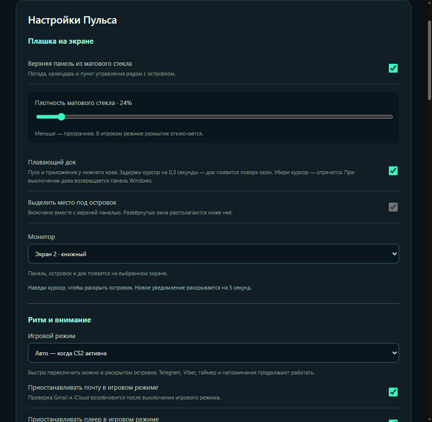
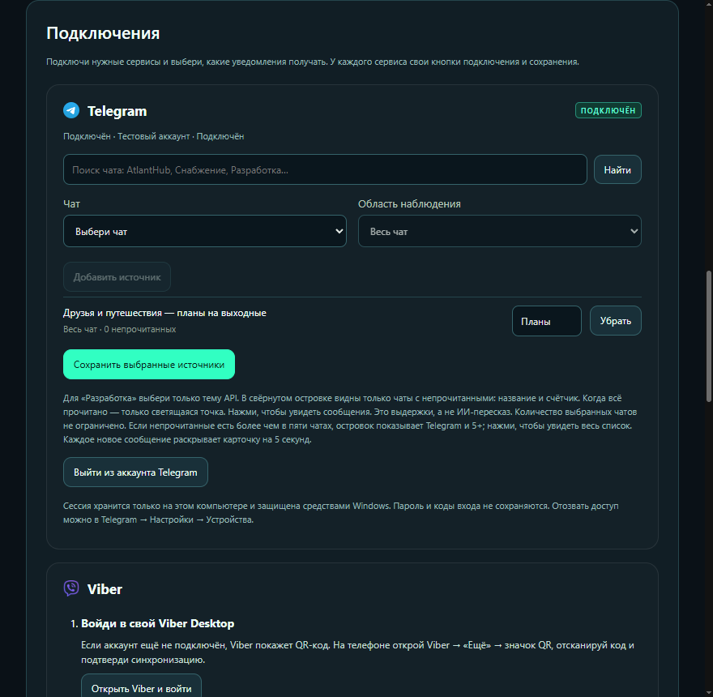
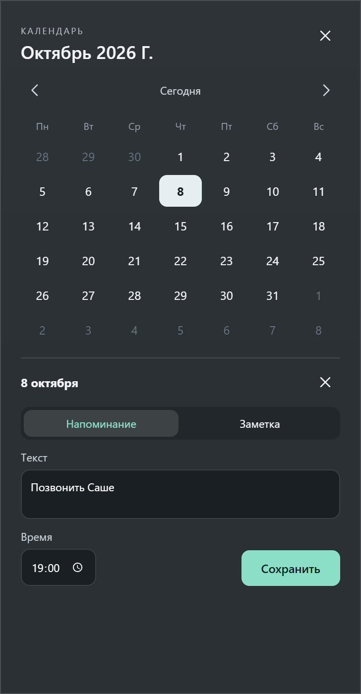

# Первый запуск Пульса

[← Страница Пульса](../README.md) · [Скачать установщик](https://github.com/VP-code98/pulse-downloads/releases/latest/download/Pulse-Setup-0.13.5.exe)

## 1. Установи и открой

Скачай `Pulse-Setup-0.13.5.exe`, запусти мастер и выбери папку. Новая установка по умолчанию использует Program Files и запрашивает права администратора. Node.js не нужен. Установщик пока не подписан доверенным сертификатом; Windows может показать предупреждение об издателе.

После запуска найди значок Пульса в системном трее, при необходимости раскрыв скрытые значки. Открой **«Настройки и напоминания»**.

## 2. Настрой рабочий стол

Первый блок — **«Настройки Пульса»**:

- Включи **«Верхняя панель из матового стекла»**, чтобы рядом с островком появились погода, часы, календарь и пункт управления.
- Включи **«Плавающий док»**, если хочешь использовать его у нижнего края. При выключении дока возвращается панель задач Windows.
- При включённой верхней панели место под островок выделяется автоматически. Для отдельного островка можно включить **«Выделить место под островок»**.
- Выбери нужный экран в поле **«Монитор»** или оставь автоматический выбор.
- В разделе **«Ритм и внимание»** настрой игровой режим, паузу почты и плеера, звук уведомлений и «Не беспокоить». Автоматический игровой режим сейчас относится к активной CS2.
- Если нужно, включи запуск вместе с Windows.

Нажми **«Сохранить настройки»** в конце первого блока. После новой установки верхняя панель и док выключены — это не ошибка.

## 3. Подключи нужное

Второй блок — **«Подключения»**. У сервисов собственные кнопки подключения и сохранения.

### Telegram

Нажми кнопку входа и выполни подсказки Пульса. После подключения найди чат, выбери его; в группе с темами можно выбрать отдельную тему. Нажми **«Добавить источник»** и затем **«Сохранить выбранные источники»**. Короткая подпись пригодится для компактного островка.

Telegram Desktop можно закрыть: у Пульса собственная сессия. Для удаления источника нажми **«Убрать»**, затем сохрани список. Выход из аккаунта выполняется отдельной кнопкой.

### Viber

Войди в Viber Desktop, нажми **«Подключить Viber»** и отметь нужные чаты. Выбор сохраняется сразу. Viber Desktop должен оставаться запущенным; окно можно свернуть. Пульс также покажет уже накопленные непрочитанные сообщения выбранных чатов.

### Gmail

Публичная проверка доступа Google ещё идёт. Пока она не завершена, Gmail не заявлен готовым для массового подключения. Участники проверки входят кнопкой **«Войти через Google»** через системный браузер. Пароль Google вводится на странице Google.

### iCloud Mail

Введи адрес iCloud и отдельный **пароль приложения**, созданный в аккаунте Apple. Ссылка **«Как получить пароль приложения»** есть в карточке подключения. Основной пароль Apple в Пульс вводить не нужно.

### Сайты

Добавь адрес сайта. Открой его в Chrome или Edge, разреши уведомления сайта и браузера в Windows. Пульс покажет новые уведомления, дошедшие до центра уведомлений Windows. Сайт должен сам отправлять уведомления; число непрочитанных на веб-странице не является таким уведомлением.

## 4. Создай напоминание

Нажми **дату или время справа в верхней панели → выбери день → «+ Напоминание или заметка»**. Выбери «Напоминание», введи текст и время, нажми **«Сохранить»**. Для обычной заметки выбери вкладку «Заметка».

Напоминание появится в островке в выбранное время. Пульс должен быть запущен, а компьютер — работать. Управление записями находится в этом же календаре.

## 5. Пользуйся каждый день

Наведи курсор на островок для подробностей. Подведи курсор к нижнему краю, чтобы показать док. Погода открывается нажатием на температуру слева; город выбирается в её карточке. Кнопка с ползунками справа открывает пункт управления, а кнопка со щитом — сохранённые VPN Windows.

Для обновления или выхода используй меню значка Пульса в трее. [Если что-то не получается →](FAQ.md)
